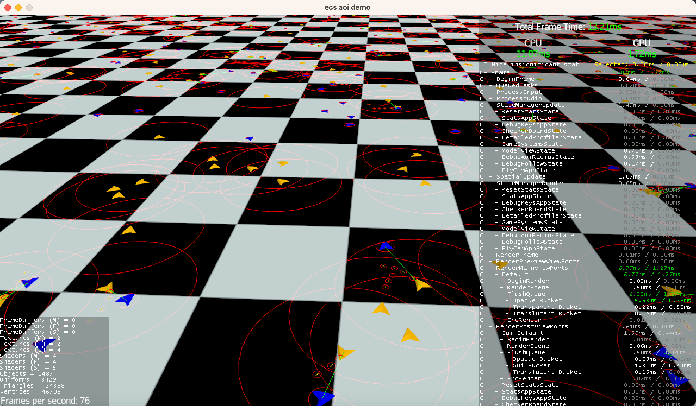

# ECS aoi demo

AOI: 兴趣区域。AI 只会追踪自己附近的对象，而不是遍历整个地图中的所有敌人。

描述

* 地图大小为 256 * 256
* 1000 个蓝色飞船在地图中随机移动.
* 1000 个橙色飞船在地图中静止不动.
* 如果蓝色飞船接近橙色飞船(距离 < 5.0), 则橙色飞船会追踪蓝色飞船, 并发射子弹.
* 如果子弹距蓝色飞船太近(距离 < 0.2), 则蓝色飞船就会被子弹杀死.
* 如果蓝色飞船距离橙色飞船太近(距离 < 0.6), 则橙色飞船就会被蓝色飞船撞毁.

按键

* F2: 显示/隐藏调试追踪目标
* F3: 显示/隐藏碰撞半径
* F4: 显示/隐藏区域
* F5: 显示/隐藏统计信息
* F6: 显示/隐藏详细性能信息

AOI: area of interest. AI will only track the nearby objects, not the whole map.

Description

* map size is 256 * 256
* 1000 blue airships are moving around the map.
* 1000 orange airships are standing in the map.
* the orange airships will chase the blue airships is close to it (distance < 5.0), and shot bullet to the blue airships.
* the blue airships will be killed by bullet if close to it (distance < 0.2).
* the orange airships will be killed the blue airships if close to it (distance < 0.6).

Keys

* F2: show/hide debug chase target
* F3: show/hide debug collision radius
* F4: show/hide debug area
* F5: show/hide stat info
* F6: show/hide detailed profiler info

